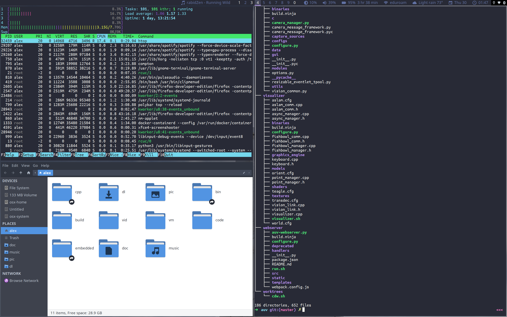
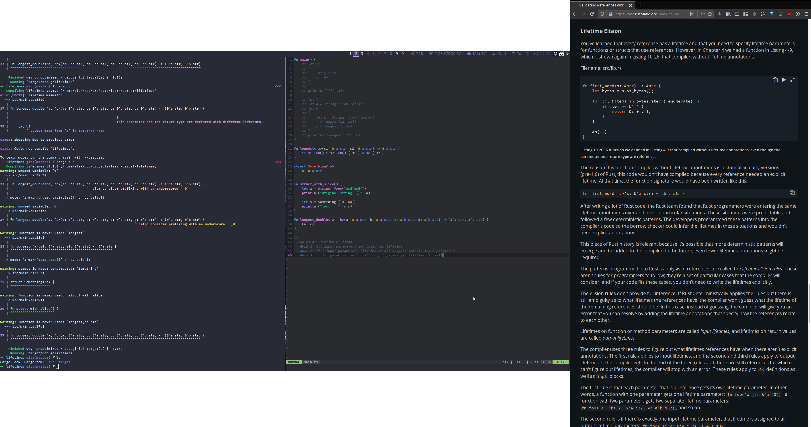

# Alex Ozer's Unix Dotfiles

These are automatically pushed nightly, and manually by me on occasion with
a commit message equally lacking in description. Enjoy!

## Screenshots




(this is bspwm, I've recently switched to i3 however, we'll see how it goes...)

## Install

You can symlink these dotfiles to your home directory using GNU stow:

```bash
$ cd
$ git clone https://github.com/alexozer/dotfiles.git .dotfiles
$ cd .dotfiles
$ stow vim zsh i3 # ...
```

## My Setup

I use:

- Hardware
    - Desktop: [this custom build](https://pcpartpicker.com/list/WJv8D2)
    - Laptop: Macbook Pro Retina 2015 MF840LL/A
    - Primary monitor: Dell Ultrasharp U2415
    - Keyboard: KBD75 V1
- Arch Linux
- i3 (window manager)
- Xfce (desktop environment utilities)
- FZF (fuzzy searcher, I use for programs, files, bookmarks, passwords, clipboard, vim, killing processes)
- Kitty (terminal)
- Zsh (shell)
- Oh My Zsh (zsh plugin mananger)
- Firefox Developer Edition (browser)
- Jetbrains IDEs (for "deeper" coding)
- Neovim (for general-purpose text editing, light coding)
- Visual Studio Code (for misc. language editing)
- Clipmenu (clipboard history manager)
- pass (password manager)
- Dracula (terminal colorscheme)
- Arc Darker (GTK theme)
- Papirus (icon theme)
- Human (cursor theme)
- Fira Code/Fira Mono (editor, terminal, status bar font)
