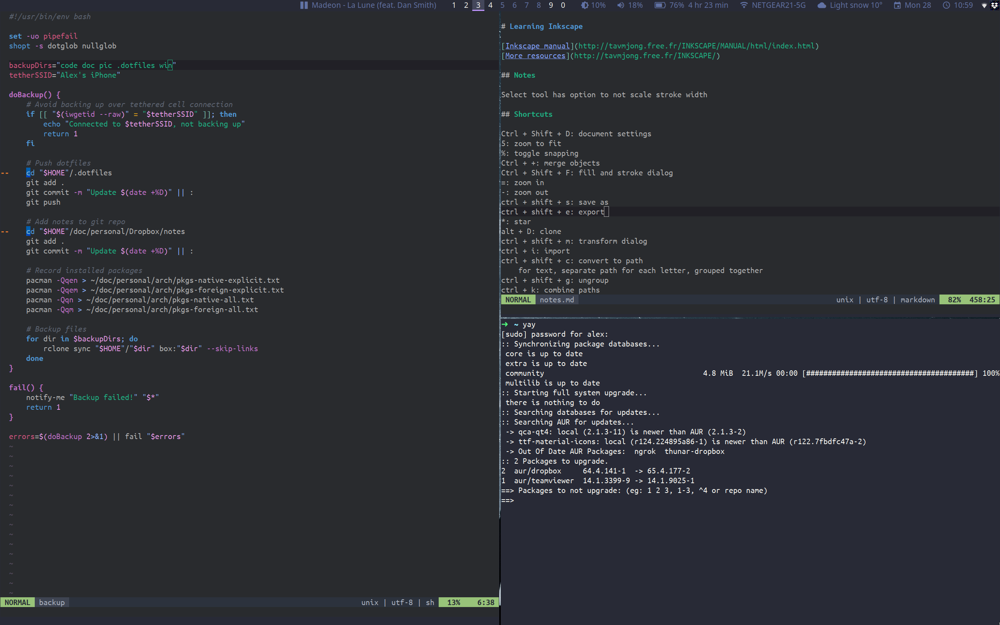

# Alex Ozer's Unix Dotfiles

These are automatically pushed nightly, and manually by me on occasion with
a commit message equally lacking in description. Enjoy!

## Screenshots




## Install

You can symlink these dotfiles to your home directory using GNU stow:

```bash
$ cd
$ git clone https://github.com/alexozer/dotfiles.git .dotfiles
$ cd .dotfiles
$ stow vim zsh bspwm # ...
```

## My Setup

I use:

- Macbook Pro Retina 2015 (MF840LL/A)
- Arch Linux
- Bspwm (window manager)
- Xfce (desktop environment minus window manager)
- Whiskermenu (launcher)
- Polybar (panel)
- Gnome Terminal
- Zsh (shell)
- Antigen (zsh plugin mananger)
- Jetbrains IDEs (code editor)
- Visual Studio Code (misc language editor)
- Neovim (general-purpose text editor)
- FZF (fuzzy searcher, I use for files, bookmarks, passwords, clipboard)
- Clipmenu (clipboard history manager)
- gopass (password manager)
- Dracula (terminal, Vim, VSCode, Polybar, and Rofi colorscheme)
- Arc Darker (GTK theme)
- Papirus (icon theme)
- Human (cursor theme)
- Ubuntu Mono derivative Powerline (terminal font)
- Fira Code (VSCode font)
