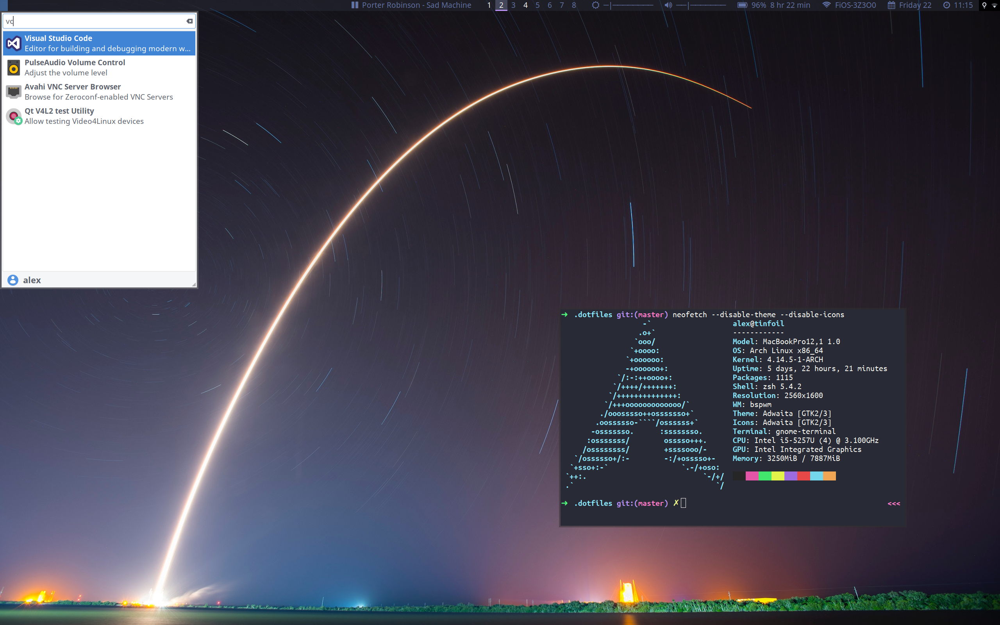
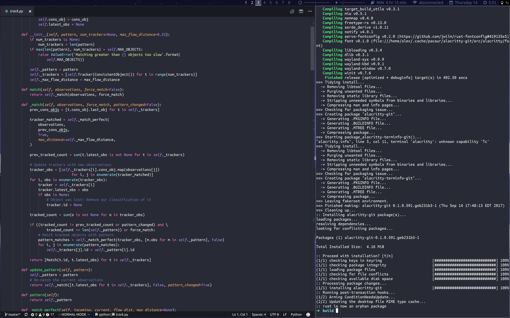
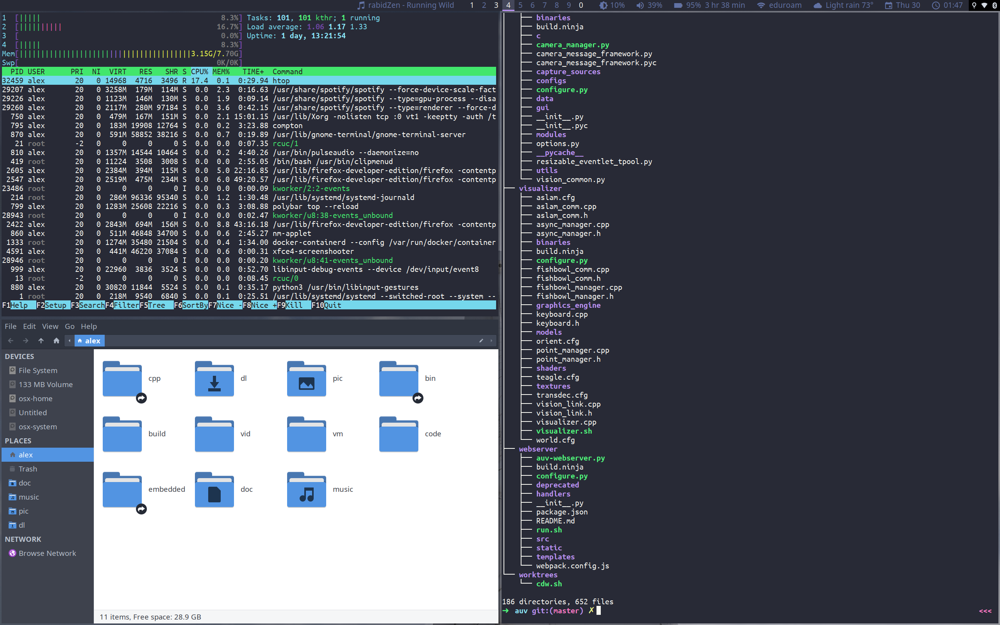

# Unix Dotfiles

> Alex Ozer

This is where I share my dotfiles, with terrible commit messages that is.

Current screenshots:




I use:
- Macbook Pro Retina 2015 (MF840LL/A)
- Arch Linux
- Bspwm (window manager)
- Xfce (desktop environment minus window manager)
- Compton (transparency, shadows, ...)
- Whiskermenu (launcher)
- Polybar (panel)
- Gnome Terminal
- Zsh (shell) with Antigen
- Visual Studio Code (code editor)
- Neovim (general-purpose text editor)
- Dracula (terminal, vim, vscode, and polybar colorscheme)
- Arc Darker (GTK theme)
- Papirus (icon theme)
- Human (cursor theme)
- Ubuntu Mono derivative Powerline (terminal font)
- Fira Code (VSCode font)

You can symlink these dotfiles to your home directory using GNU stow:
```bash
$ cd
$ git clone https://github.com/alexozer/dotfiles.git .dotfiles
$ cd .dotfiles
$ stow [dir]
```
